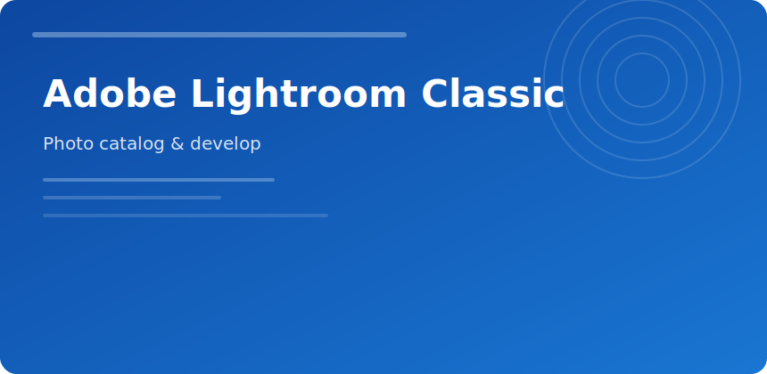

  

  

### Adobe Lightroom Classic

Catalog-centric workflow for shooters who deliver **hundreds of frames per job**—weddings, events, product batches.

#### Library vs Develop

| Module | Focus |
|--------|-------|
| Library | ingest, keywords, culling stars |
| Develop | exposure, profile, local masks |
| Map | geo for travel sets |
| Book/Print | client albums |

#### Batch tips

- Sync develop settings only after picking a hero frame
- Use color labels for retouch handoff
- Export DNG for archive; JPEG sRGB for web

#### Storage

Keep catalog on SSD; originals can live on NAS with stable paths.

adobe lightroom classic photography raw catalog develop presets
